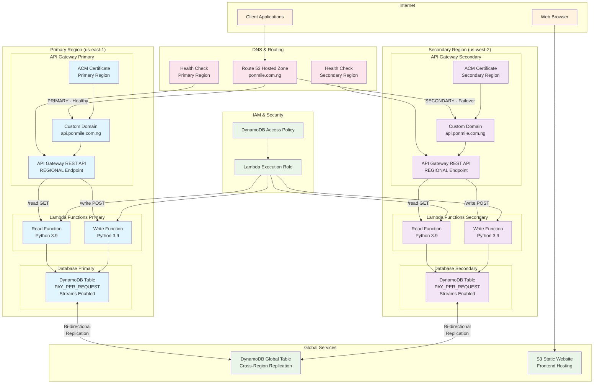

# High Availability Multi-Region Architecture Explanation

## 🏗️ Architecture Overview

This Terraform configuration creates a highly available, multi-region API architecture with automatic failover capabilities. Here's how each component works:

## Architecture Diagram



## 📍 Traffic Flow

### 1. **Client Request Journey**
```
Client → Route 53 → Health Check → API Gateway → Lambda → DynamoDB
```

### 2. **DNS-Based Failover**
- **Primary Route**: Route 53 directs traffic to Primary Region (us-east-1)
- **Health Monitoring**: Continuous health checks on both regions
- **Automatic Failover**: Traffic switches to Secondary Region (us-west-2) if primary fails
- **Recovery**: Traffic returns to primary when it's healthy again

## 🔧 Key Components

### **Route 53 DNS Management**
- **Hosted Zone**: Manages `ponmile.com.ng` domain
- **Health Checks**: Monitor API endpoints every 30 seconds
- **Failover Policy**: 
  - PRIMARY record points to us-east-1
  - SECONDARY record points to us-west-2
- **Automatic Switching**: DNS responds with healthy endpoint

### **API Gateway (Regional Endpoints)**
- **Regional Deployment**: Deployed in both regions for low latency
- **Custom Domain**: `api.ponmile.com.ng` maps to both regions
- **CORS Enabled**: Supports cross-origin requests
- **Endpoints**:
  - `GET /read` - Retrieve data
  - `POST /write` - Store data
  - `OPTIONS` - CORS preflight

### **Lambda Functions**
- **Serverless Compute**: Auto-scaling, pay-per-use
- **Identical Deployment**: Same functions in both regions
- **Environment Variables**: Table name configuration
- **IAM Permissions**: Access to DynamoDB in respective regions

### **DynamoDB Global Tables**
- **Multi-Region Replication**: Data synced between regions
- **Bi-directional Sync**: Changes replicate both ways
- **Eventually Consistent**: Data consistency across regions
- **Streams Enabled**: Captures data changes for replication

### **SSL/TLS Certificates**
- **Regional Certificates**: ACM certificates in each region
- **DNS Validation**: Automated certificate validation
- **Auto-Renewal**: AWS manages certificate lifecycle

## 🔄 How Failover Works

### **Normal Operation (Primary Active)**
1. Client queries `api.ponmile.com.ng`
2. Route 53 returns Primary Region IP (us-east-1)
3. Request goes to Primary API Gateway
4. Lambda processes request using Primary DynamoDB
5. Data changes replicate to Secondary Region

### **Failover Scenario (Primary Down)**
1. Health check detects Primary Region failure
2. Route 53 marks Primary as unhealthy
3. New DNS queries return Secondary Region IP (us-west-2)
4. Existing connections may need to retry
5. Secondary Region serves all traffic
6. Data remains available via replicated DynamoDB

### **Recovery (Primary Restored)**
1. Health check detects Primary Region recovery
2. Route 53 marks Primary as healthy
3. New DNS queries return Primary Region IP
4. Traffic gradually shifts back to Primary
5. Normal operation resumes

## 🎯 Benefits of This Architecture

### **High Availability**
- **99.9%+ Uptime**: Multiple failure points eliminated
- **Regional Redundancy**: Survives entire region outages
- **Health Monitoring**: Automatic failure detection

### **Performance**
- **Regional Endpoints**: Reduced latency via geographic proximity
- **Serverless Scaling**: Auto-scales with demand
- **CDN Ready**: S3 frontend can integrate with CloudFront

### **Data Consistency**
- **Global Tables**: Data available in both regions
- **Stream-based Replication**: Near real-time data sync
- **No Data Loss**: Writes replicate automatically

### **Cost Optimization**
- **Pay-per-Use**: Lambda and DynamoDB scale to zero
- **Regional Deployment**: Optimize costs by region
- **Efficient Routing**: Minimize cross-region data transfer

## 🛠️ Key Configuration Details

### **API Gateway Domain Fix**
The original issue was resolved by using:
```hcl
regional_certificate_arn = aws_acm_certificate.primary.arn
```
Instead of:
```hcl
certificate_arn = aws_acm_certificate.primary.arn
```

### **CORS Configuration**
- Enables web browser access from any origin
- Supports standard HTTP methods
- Handles preflight OPTIONS requests

### **IAM Security**
- Least privilege access for Lambda functions
- DynamoDB permissions scoped to specific tables
- Cross-region access properly configured

## 🚀 Deployment Considerations

1. **Certificate Validation**: Ensure DNS records for ACM validation
2. **Domain Ownership**: Route 53 hosted zone must exist
3. **Lambda Code**: Upload actual function code to `/lambda/` directory
4. **Frontend**: Upload HTML files to `/frontend/` directory
5. **Testing**: Verify health checks after deployment

This architecture provides enterprise-grade reliability with automatic failover, making it suitable for production workloads requiring high availability.
